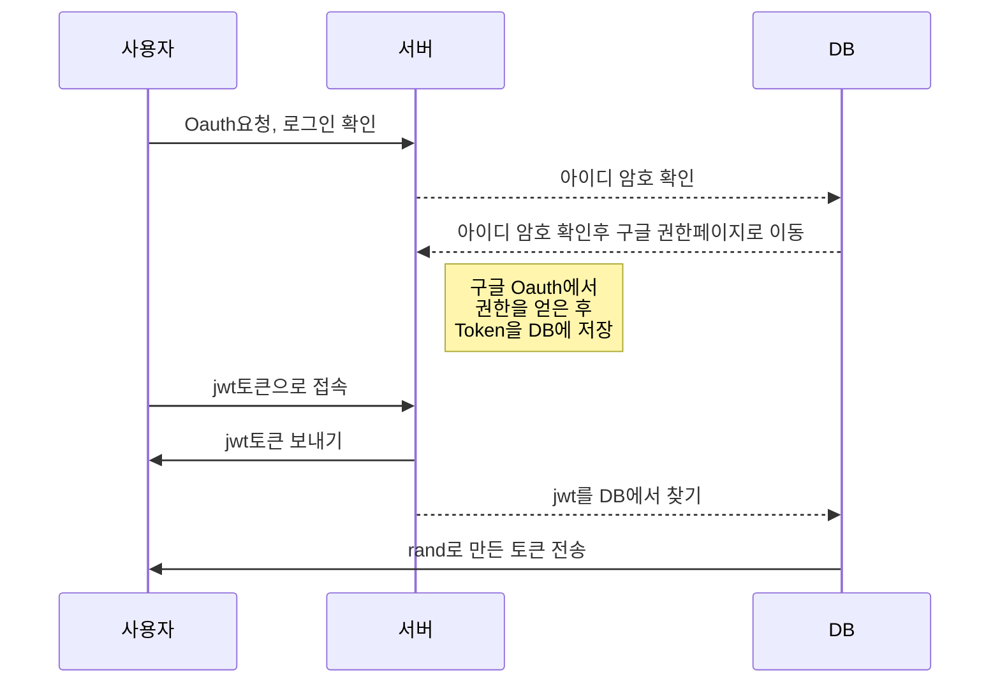

# 건강마스터!

**건강마스터!**는 SK NUGU 용으로 개발된 웹사이트와 챗봇입니다. 구글 피트니스의 api를 가져오는 형식으로 어제와 오늘, 일주일, 한달, 특정 달의 조회가 가능합니다. 가입후 로그인 시 사이트에서는 최근 한달의 데이터를 조회할 수 있습니다.

OAUth2 authorization code 형식으로 구현을 하였습니다. 구글 피트니스의 oauth를 받아오는 부분과 oauth를 만드는 부분을 둘 다 만들어야 했습니다.

언어는 nodejs로 구현하였습니다. 원래는 java로 구현을 하려고 했으나 혼자서 웹과 챗봇 둘 다 개발을 해야 했기에 오류찾기 쉽고, 그 동안 챗봇을 만든 언어인 nodejs를 사용하게 되었습니다.

개발기간은 20일 정도 입니다.

* 코드 정리가 되어 있지는 않습니다. 한정된 시간안에 급하게 만든 거라서.
* 이 코드에는 google oAuth와 개인 Oauth, data.go.kr의 토큰등이 빠져 있습니다.

## 사용 API

사용 API는 다음과 같습니다. 각 API의 조회 수의 한계로 인해서 DB에 1시간 단위로 저장을 합니다. 1시간 단위 저장은 **cron.yaml**을 이용했습니다.

* 기상청 현재날씨
* 기상청 불쾌지수
* 기상청 체감온도 지수
* 기상청 3시간 단기 예보
* 기상청 음식 부패지수
* 기상청 자외선 지수
* 국민건강보험공단 질병예보 지수
* 에어코리아 미세먼지

## 클라우드 서버

개발서버는 **Google App engine엔진**과 **Google mysql**을 사용했습니다. 이유는 구글 어시스턴트 개발때 주는 매달 200달러 쿠폰이 있어서 입니다.

## Oauth2 구조

본 서비스는  Oauth2 authorization code형태로 구현했으며, 현재 다음과 같은 구조로 토큰을 전송하고 있습니다.

* jwt로 생성하지만 다른 임의의 난수를 생성해도 됩니다.
* rand는 임의의 코드를 생성하는 모듈입니다. 여기서는 32자리로 생성했습니다.

자세한 사항은 [ietf](https://tools.ietf.org/html/rfc6749#section-4.1.1) 사이트를 참조하시면 됩니다.

## PPT

PT발표용 파일과 기획서 제출 파일입니다.

* [기획서](./pds/camellia_final_.Plan.pptx)
* [8분 발표용 수정](./pds/camelia_final_speech_8min_censorship.pptx)

