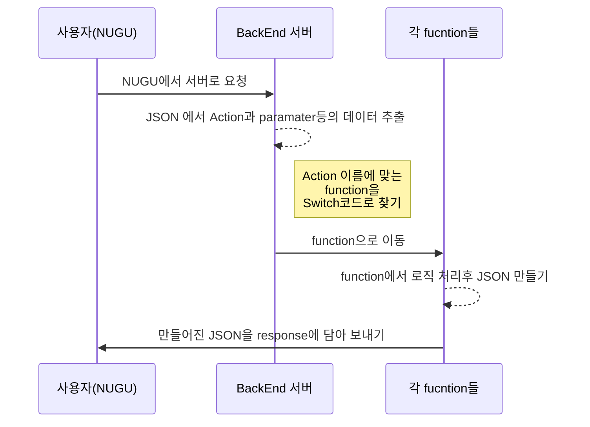

# SK NUGU play kit for GCP Cloud Functions용 샘플코드

## 개요

본 페이지의 샘플코드는 Google GCP의 [Cloud Functions](https://cloud.google.com/functions/)에 올릴 수 있게 만들어진 샘플코드 입니다. 여기서는 로또 당첨 번호를 조회하는 챗봇으로 설명을 합니다. 설명하는 코드를 위해서 만든 챗봇이 **로또번호 조회**인 이유는 다음과 같습니다.

물론 수학 잘하는 사람은 로또를 하지 않습니다.

* 숫자라는 데이터를 이용한다는 점에서 정형화.
* **API**가 공개돼 있고 특별한 인증키가 필요하지 않음.
* 실생활과 밀접하게 사용 되고 있고, 누구나 알고 있는 서비스. (미성년자는 안되지만...)

이 서비스에서는 **로또번호의 생성**과 **현재 당첨번호**, **이전 회차의 당첨번호** 그리고 **복권 교환장소**라는 4가지 기능과 **Play Kit상에서 동작하는 2개의 기능**(도움말 기능)을 만들었으며, 각각의 기능은 기초적인 설명을 넣었습니다.

챗봇을 만드는 사람이 최대한 이해하기 쉽게 쓰고자 했지만 혹시 어려운 점이 있으면 E-mail을 보내주시면 되겠습니다.

## 특징

이 샘플코드의 특징은 다음과 같습니다.

 1. 이해하기 쉽게 만들었습니다.

남이 짠 코드도 힘든데 새로운 기능도 만들어야 한다면...

일반적인 샘플 코드의 경우 class를 쓴다던가 하는 고급기술을 쓰거나 아마존 EC2(구글에서는 앱엔진)을 써서 파일을 여러개로 분리하는 방식을 사용하고 있습니다. 이 방식이 맞긴 맞지만, 이해하기 어려운 내용이 있습니다. 특히 **기초를 이해해야 다음 단계로 이해**를 하는데, 처음 챗봇을 제작하는 입장에서는 이런점도 어려운 부분입니다. 이를 해결하고자 **한 페이지**로 간단하게 만들었습니다.

 2. 서버 비용 문제 해결

비용의 차이가 느껴지십니까?

샘플 코드들의 경우 **AWS EC2**같은 비싼 서비스에 올리기 힘든 코드가 있습니다. 개인개발자의 경우 그럴 비용을 내고 싶지 않은게 현실입니다. 때문에  [Cloud Functions](https://cloud.google.com/functions/)이나 [Lamda](https://aws.amazon.com/ko/lambda/features/)를 사용하여 올릴 수 있도록 만들게 되었습니다. 저 또한 [Cloud Functions](https://cloud.google.com/functions/)을 자주 사용하는 입장입니다.

3. 여러 기능을 체험

각각의 기능은 **Parameter**를 **여러 개로 보내는 방식**과, **텍스트를 한번에 보내는 방식**을 구현하여, 개발자가 구현할 수 있는 방식을 만들었습니다. 또한 **Parameter**를 받는 방법을 예시로 적었습니다.

## NUGU Play Kit 설정하기

우선 **NUGU play Kit**으로 가서 제작을 해봅시다. **NUGU play kit**은
다음과 같은 형태중 **NUGU**의 인터페이스를 설계하는 곳입니다.

NUGU play kit

이런 형태로 **DashBoard**가 보일 것입니다. 이제 하나씩 만들어 봅시다.

>이 실습결과로 만들어진 intent아 Entity의 export된 (Action은 백업이 되지 않습니다) 백업 [json File](https://github.com/lunaStratos/sk_Nugu_chatbot/blob/master/nugu_lotto/img/training_data_lottomaster.json)> 을 제공합니다. 
>import로 부르면 됩니다. 

### 1. Play kit 만들기 & 서버 설정

우선 플레이 킷을 만듭니다. [NUGU Developer](developers.nugu.co.kr/)에서 계정을 만들고 [play kit](https://builder.nugu.co.kr/index.html#/dashboard/playList) 에서 **Custom Plays**을 만듭니다.

우선 **BackEnd**에 서버 주소를 입력합니다. **GCP**의 **Cloud function**의 소스 주소를 입력합니다. 이로서 서버 연동 주소를 입력을 완료했습니다.

>내부에 /health 주소는 안만들어도 됩니다. Cloud function이 자동으로 200을 돌려주기 때문입니다.

### 2. Intent 설정

Intent는 사용자의 발화를 입력하는 부분입니다. **최소 10개 이상은 넣는게 안전**하다고 봅니다만, 저 같은 경우는 20개 정도를 넣습니다. 최대한 머리를 짜내어(..) 넣어보도록 합시다.

Intent 이름은 Intent.name 형식으로 입력을 하였습니다. 여기서는

* intent.selectLottoNum
* intent.makeLottoNum
* intent.lottoChange
* intent.nowLotto
* intent.support
* intent.help

총 6가지 가지를 입력 했으며 이중 4종류의 Intent는 **BackEnd**연동을, 나머지 2개는 Play Kit에서 처리를 하게 됩니다.

 1. intent.selectLottoNum

 특정 회차를 말하면 API를 이용하여 당첨번호와 1등 상금액수 등을 조회하는 기능입니다.

* 272회차 당첨번호를 알려줘
* 723회차 로또번호를 말해줘
* 811회차 당첨 번호를 조회해 줘
* 682회 로또 당첨 번호는 어떻게 되었어
* 582회의 로또 당첨번호를 말해줘
* 293회차의 당첨번호를 알려줘
* 28회차 로또번호는 어떻게 되
* 282회의 로또번호는 어떻게 되
* 382회차 로또번호를 알려줘

다음과 같은 형태로 입력을 하였습니다. 각 숫자에는 **BID_QT**라는 **숫자 Built-In Entity**를 사용하였습니다. NUGU에서 **미리 만들어진 Entity**로 사용자가 말한 숫자를 인식하여 **Parameter**로 이용합니다. 숫자 부분에 드래그를 해서 Entity적용을 합니다.

Entity 입력방법은 다음과 같습니다. **크롬에서 하셔야 합니다. 파이어폭스에서는 안됩니다**

먼저 Intent를 입력합니다. 그리고 나서

숫자 부분에 드래그를 합니다

드래그를 하면 Entity 입력 창이 뜹니다. BID_QT라는 미리 만들어진 Entity를 선택하면 됩니다.

그러면 Entity로 지정된 하나의 Intent가 완성이 되었습니다.

이렇게 설명하면 이해하기 힘들수도 있어서 gif로 만들어 봤습니다.

나머지 Intent들도 이렇게 숫자만 드래그를 하여  **BID_QT**로 설정하면 됩니다.

 2. intent.makeLottoNum

6개의 로또번호의 생성을 인식하는 Intent입니다. Intent는 다음과 같습니다.

* 당첨될 만한 로또번호를 말해줘
* 로또번호를 하나 생성해줘
* 로또번호를 하나 만들어줘
* 로또번호를 만들어 줄래
* 로또번호를 만들어줘
* 로또번호 생성해줘

makeLottoNum Intent는 Entity가 필요없기 때문에 입력하고 저장만 하면 끝납니다.

 3. intent.lottoChange

로또 교환장소를 알려주는 Intent입니다.  Intent는 다음과 같습니다.

* 로또 2등 당첨금 교환 장소를 알려줘
* 로또 1등의 당첨금 교환은 어디서 해
* 로또 4등 교환장소를 알려줘
* 2등의 교환장소는 어디야
* 5등 교환장소를 알고싶어
* 4등이 당첨되었는데 어디서 교환해
* 3등 로또 당첨번호 교환하는 곳을 알려줘
* 2등 교환장소는 어디로 가야해
* 1등로또 교환장소를 알고싶어

교환장소 역시 특정 회차 로또조회처럼 **BID_QT**라는 **숫자 Built-In Entity**를 사용하였습니다. NUGU에서 **미리 만들어진 Entity**로 사용자가 말한 숫자를 인식하여 **Parameter**로 이용합니다. 숫자 부분에 드래그를 해서 Entity적용을 합니다.

**Entity 적용 방법**은 **특정 회차 로또기능에 설명**을 했기에 생략합니다.

 4. intent.nowLotto

최근의 로또당첨번호와 1등상 액수 등을 인식하는 Intent입니다. Intent는 다음과 같습니다.

* 저번 로또 당첨번호
* 저번의 로또 당첨번호
* 저번 로또번호를 알려줘
* 최근 당첨번호를 알려줘
* 최근 어떤 번호가 당첨이 되었어
* 최근 로또번호를 알려줘
* 이번주로 로또번호를 조회해줘
* 이번 로또번호를 알고싶어
* 이번주의 로또번호를 알려줄래
* 이번 로또번호는 어떻게 되었어
* 이번주의 로또 당첨번호를 알려줘
* 이번주 번호는 어때
* 이번 당첨번호를 알려줘
* 이번주 당첨번호를 알려줘
* 이번주 로또번호를 알려줘

nowLotto Intent는 Entity가 필요 없기 때문에 입력하고 저장 하면 끝납니다.

### 3. Action 설정

Action은 각 Intent를 연결하여 실질적으로 서버와 통신을 하는 부분입니다. 여기서는  서버의 연동여부와 Request & Response의 **Parameter**를 설정할 수 있습니다.

 1. action.selectLottoNum

전체스크린입니다. 이해를 위해서 하나만 첨부합니다.

intent.selectLottoNum에 연결할 Action입니다.

* Request **Parameter** 이름 : **selectNum**
* Response **Parameter** 이름 : **selectLotto**

우선 **Utterance Parameter**의 **Parameter Name**에는  **selectNum**로 이름을 씁니다. **Entity mapping**에는 **BID_QT**을 하며, 필수에 체크를 하여 회차번호를 말하지 않았을때 물을 말을 넣습니다.

**BackEnd proxy 사용 여부**에는 활성화를 한 후 **BackEnd Parameter**의 **Parameter Name**에는 **selectLotto**으로 이름을 설정합니다.

다음과 같이 설정을 하였습니다. Request & Response의 **Parameter**가 하나뿐이기 때문에 각각 **Parameter**가 하나뿐 입니다. 지정된 **Parameter**의 이름은 BackEnd에서 동일한 이름으로 사용해야 합니다. 이건 샘플코드에서 보시면 되겠습니다.
(정 이해가 안된다면 **Parameter**이름인 **selectLotto**와 **selectNum**로 찾아보세요. )

텍스트 입력은 다음과 같이 **Response Parameter**이름인 **selectLotto**를 넣으면 끝입니다.

정 모르겠다면 이 영상을 보시면 됩니다. 입력하는 방법을 Gif로 찍어봤습니다.

 2. action.makeLottoNum

intent.makeLottoNum에 연결할 Action입니다.

* Request **Parameter** 이름: **없음**

* Response **Parameter** 이름 :
**firstNum**
   **secondNum**
   **thirdNum**
   **fourthNum**
   **fifthNum**
   **sixthNum**

Request시에는 없으니 Response 시에는 6개의 **Parameter**을 사용하는 형태입니다.

우선 **Utterance Parameter**에는 아무것도 설정하지 않습니다. **Parameter**를 요청할게 없기 때문입니다.

**BackEnd proxy 사용 여부**에는 활성화를 한 후 **BackEnd Parameter**의 **Parameter Name**에는 위의 6개 **Parameter**를 입력합니다.

다음과 같이 설정을 하였습니다. Response는 **Parameter**가 6개이며 이름은 BackEnd에서 Parameter를 저장할때 동일한 이름으로 사용해야 합니다.

 3. action.lottoChange

intent.lottoChange에 연결할 Action입니다. 여기서는 텍스트를 한거번에 처리하여 Parameter에 넘길 예정입니다.

* Request **Parameter** 이름 : **selectPrize**
* Response **Parameter** 이름 : **lottoChange**

 **Utterance Parameter**의 **Parameter Name**에는  **selectPrize**로 이름을 씁니다. **Entity mapping**에는 숫자가 입력된 **BID_QT**을 하며, 필수에 체크를 하여 등수를 말하지 않았을때 물을 말을 넣습니다.

**BackEnd proxy 사용 여부**에는 활성화를 한 후 **BackEnd Parameter**의 **Parameter Name**에는  **lottoChange**라는 **Parameter** 이름을 입력합니다.

텍스트 처리는 다음과 같습니다.

 4. action.nowLotto

intent.nowLotto에 연결할 Action입니다.

* Request **Parameter** 이름 : **없음**
* Response **Parameter** 이름 :   
		**firstPrizeHuman**
        **resultFirstPrize**
        **dateText**
        **kai**
        **first**
       **second**
       **third**
       **fourth**
        **fifth**
       **sixth**
        **bnusNo**

각각의 값의 설명은 다음과 같습니다.

> Response Parameter 설명
    firstPrizeHuman  : 1등상 당첨자수와 자동수동 여부
     resultFirstPrize  : 1등상 액수
     dateText  : 날짜
      kai : 회차
      //이하는 각 회차의 당첨번호
	   first
      second
      third
       fourth
      fifth
        sixth
        bnusNo: 보너스 번호

Response **Parameter**를 이런 방식으로 사용할 경우, **Parameter**의 갯수가 많기 때문에 이름을 설정할 때 알아보기 쉽게 해야 합니다. 대소문자가 지원되니 이점을 활용하시면 될거 같습니다.

 **Utterance Parameter**는 입력하지 않습니다.

**BackEnd proxy 사용 여부**에는 활성화를 한 후 **BackEnd Parameter**의 **Parameter Name**에는  위의 다양한 **Parameter** 이름을 입력합니다.

마지막으로 작동시 NUGU가 말할 텍스트를 입력합니다. **사용자 경험**상 많은 입력을 하면 좋지만 여기서는 3가지 입력만 하겠습니다.

5. action.support & action.help

위 **Action**은 **Play kit**상에서 동작을 하게 됩니다. 때문에 **BackEnd**에 연동될 필요가 없습니다. 만약 연산이나 DB등을 사용하지 않고, 단순히 말하는 **Play kit**을 만들고 싶다면 **Play kit**에서 데이터만 입력하여 만들면 됩니다.

이로서 **Play Kit**에서의 처리가 모두 끝났습니다. 이제 **BackEnd**를 설계해야 합니다.

## BackEnd 로직 구조

 1. 사용자가 말한 내용을 **NUGU Play Kit**이 처리를 하여 적절한 Intent를 찾습니다. Intent는 연결된 Action을 찾아 설정된 방식으로 **BackEnd** 서버에 **Request서버에 JSON**을 보냅니다.

 2. 서버에는 들어온 **JSON을 분해**하여 *Action*이름과 *Parameter*를 받습니다. *Parameter는 나중에 각 function에서 사용*하게 됩니다.

 3.  하단의 Switch 문에서 *Action이름으로 설정된 function*을 찾아 작동을 합니다.

 4. function에서 데이터를 처리합니다. 만약 **Parameter**를 사용한다면 미리 파싱한 **Parameter**를 이용하여 값(Value)를 찾아 사용을 하면 됩니다.

 5. 처리된 값을 Output 이라는 변수에 **Parameter**에 넣습니다. 이때 처리된 **결과 값들만 Parameter****에 넣을지, 아니면 **텍스트 자체를 Parameter**에 넣을지를 선택하면 됩니다. 여기서는 두 가지 방식 다 샘플로 보여드립니다.

 > 텍스트 전체를 넘기는 경우 오류시 적절한 텍스트를 취사 선택할 수 있습니다, 다만 사용자 경험시 랜덤화 하기 어려운 점이 있습니다. 물론 이 경우 Array로 텍스트 자체를 여러가지로 만들어서 이중 하나를 보내는 랜덤화를 할 수는 있습니다. 샘플코드에서 예시로 보여드립니다.

 > Parameter를 여러개 넘기는 경우 Play Kit에서 설정을 해야 합니다. 대답을 랜덤화 하기에는 좋지만 Play Kit페이지에서 설정을 하기 때문에 대화를 한번에 완성하기 어려울 수도 있습니다.  Parameter가 2~3개인 경우 쉽게 제작이 가능하며, 20개가 넘어가면 분간이 어렵기 때문에 두 가지 방식 중 하나를 적절히 선택하셔야 합니다.

 6. 처리된 값을 미리 만들어둔 makeJSON 이라는 function을 이용하여 Response에 넣을 JSON만듭니다.

 7. Response에 JSON을 넣어서 NUGU로 보냅니다.

## 코드 설명

이제부터 BackEnd를 해야 합니다

 이제부터 BackEnd를 해야 합니다
코드의 설명에 있어서 로또번호를 생성하는 부분을 예시로 설명하겠습니다.

### JSON 분석
처음으로 오는 부분은 **Request의 body를 분석**해야 합니다. 여기에 NUGU에서 오는 Request가 오며 이 부분에 주요 **JSON**이 있습니다. 다음은 Request가 오는 예시입니다.

    const requestBody = req.body; //request의 body부분
    if(requestBody.action.hasOwnProperty('parameters')){
      if(Object.keys(requestBody.action.parameters).length === 0){
        parameters = ''
      }else{
        parameters = requestBody.action.parameters// 파라메터 부분
      }
    } //파라메터 부분, {} 이 오는 경우를 방지해야 합니다.
    const context = requestBody.action.context; //컨텍스트, OAuth연결시 토큰이 들어옵니다
    const actionName = requestBody.action.actionName; // action의 이름

*  **Parameters** :  **NUGU Play kit**에서 지정한 **Parameter**값이 들어옵니다. 사용시 **Parameters.ParameterName.value**로 불러오면 됩니다.
*  **context** :  **OAuth**사용시 **Token**이 들어옵니다.
*  **actionName** :   **NUGU Play kit**에서 지정한 **action**이름을 얻을 수 있습니다.

이렇게 미리 파싱을 하는 이유는 function안에서 사용시 더욱 편하게 사용하기 위해서 입니다. **Action**이름으로 **Switch**를 하며, **Parameter**의 경우 여러가지 이름이 들어올 수 있기 때문에 이 정도로 파싱을 합니다. 그 다음으로는 **Switch**에서 처리를 합니다.

### Switch 부분

    //액션 선언 모음, 여기서 액션을 선언해 줍니다.
      const ACTION_NOWLOTTO = 'action.nowLotto'; //현재회차 로또
      const ACTION_SELECTLOTTONUM = 'action.selectLottoNum'; //특정회차 로또
      const ACTION_MAKELOTTONUM = 'action.makeLottoNum'; // 로또번호 생성
      const ACTION_LOTTOCHANGE = 'action.lottoChange'; // 로또 교환 장소

      // Intent가 오는 부분, actionName으로 구분합니다.
      // case안에서 작동할 function을 적습니다.
      switch (actionName) {
        case ACTION_NOWLOTTO:
          return nowlotto_function()
          break;
        case ACTION_SELECTLOTTONUM:
          return selectLottoNum_function()
          break;
        case ACTION_MAKELOTTONUM:
          return makeLottoNum_function()
          break;
        case ACTION_LOTTOCHANGE:
          return lottoChange_function()
          break;
      }

*  **ACTION_NOWLOTTO** :  NUGU Play kit에서 지정한 Action 이름인  **action.nowLotto**값이 들어옵니다. **nowlotto_function**으로 가게 됩니다.
*  **ACTION_SELECTLOTTONUM** :  NUGU Play kit에서 지정한 Action 이름인  **action.selectLottoNum**값이 들어옵니다. **selectLottoNum_function**으로 가게 됩니다.
*  **ACTION_MAKELOTTONUM** :  NUGU Play kit에서 지정한 Action 이름인  **action.makeLottoNum**값이 들어옵니다. **makeLottoNum_function**으로 가게 됩니다.
*  **ACTION_LOTTOCHANGE** :  NUGU Play kit에서 지정한 Action 이름인  **action.lottoChange**값이 들어옵니다. **lottoChange_function**으로 가게 됩니다.

현재는 예시이기 때문에 4가지 정도의 **Action**을 사용하였습니다. 여기에 **NUGU Play kit**상에서 action.help와 action.support 부분이 추가적으로 존재하지만 이는 **NUGU Play kit**에서 움직이기 때문에 **BackEnd**에서는 설계를 하지 않아도 됩니다.

### function설명

각 function은 예시를 위해서 다양하게 구성을 하였습니다.

*  **nowlotto_function**
현재 회차의 로또번호와 상금을 조회합니다. Request시 **파라메터는 없으나** Response시 **여러 파라메터 저장하여 데이터를 보내는 형태**입니다. **request**와 **cheerio**를 이용하여 웹 페이지에 대한 크롤링을 사용하였습니다.
>크롤링: 웹 페이지를 그대로 가져와서 거기서 데이터를 추출해 내는 행위

*  **selectLottoNum_function**
회차별 로또번호와 상금을 조회합니다. Request시 **파라메터에 사용자가 말한 회차**(숫자)를 가져오며, Response시 **텍스트 자체를 파라메터로 보내는 형태**입니다. **request**를 이용하여 **JSON**을 요청, 파싱하여 데이터 얻습니다. **NUGU Play kit**에서 파라메터를 받아서 사용하는 구조가 아니기 때문에 **shuffle function을 이용하여 랜덤으로 말하게** 됩니다. 자세한 것은 코드를 참조해 주세요.

*  **makeLottoNum_function**
**Request시 파라메터는 없으며 Response시 여러 파라메터 저장**하여 데이터를 보내는 형태입니다. 내부 로직을 통해서 랜덤한 로또번호를 생성합니다.

*  **lottoChange_function**
로또 당첨금 교환장소를 말합니다. **Request시 파라메터는 없으며 response 텍스트 자체를 파라메터로 저장**합니다. 정해진 텍스트를 출력하는 형태입니다.

### nowlotto_function (현재회차 조회)

> request와 크롤링 부분은 설명을 생략합니다.

    function nowlotto_function() {
    console.log('nowlotto_function')
    return asyncTask(0)
      .then(function(items) {
        console.log('items: ', items)
      //여기서 서버연결후 데이터 출력 items으로 가져옴
      let returnValue = items.returnValue; // success or fail

      if (returnValue == "fail") { // 서버접속 실패 혹은 200에러 등
        //현재회차의 경우 에러가 나는 일은 없습니다.

      } else { // 서버가 에러가 나지 않는다면
        let firstWinAmount = items.firstWinamnt; // 1등상 액수
        let firstPrizeHuman = items.firstPrzwnerCo; // 총 인원
        let rawDate = items.drwNoDate; // 당첨날짜

        //날짜 구하는 부분
        var dt = new Date(rawDate);
        let month = dt.getMonth() + 1;
        let dateText = dt.getFullYear() + '년 ' + month + '월 ' + dt.getDate() + '일';
        let kai = items.drwNo; // 회차

        // 번호들, 보너스번호
        let number1 = items.drwtNo1;
        let number2 = items.drwtNo2;
        let number3 = items.drwtNo3;
        let number4 = items.drwtNo4;
        let number5 = items.drwtNo5;
        let number6 = items.drwtNo6;
        let bnusNo = items.bnusNo;
        let firstHowTo = '';
        let resultFirstPrize = numberWithCommas(firstWinAmount);

        if (items.firstHowTo != undefined) {
          firstHowTo = items.firstHowTo
          firstPrizeHuman = firstHowTo
        }
        output.firstPrizeHuman = firstPrizeHuman;
        output.resultFirstPrize = resultFirstPrize;
        output.dateText = dateText;
        output.kai = kai;
        //당첨번호 6개의 숫자를 보낼 파라메터에 저장
        output.first = number1;
        output.second = number2;
        output.third = number3;
        output.fourth = number4;
        output.fifth = number5;
        output.sixth = number6;
        output.bnusNo = bnusNo;
        console.log(output)
        return res.send(makeJSON(output));
      }

    });
	  } // nowlotto_function

 * **output.firstPrizeHuman~bnusNo**
Response의 **Parameter**로 보낼 숫자를 넣습니다. **Parameter**의 이름은 **Action**에서 지정한 **Parameter**와 동일한 이름(**firstPrizeHuman~bnusNo**)으로 합니다.

* **return res.send(makeJSON(output));**
Response JSON을 만들어 둔 function에 **Parameter** 데이터를 넣어서 **NUGU**에 전송을 합니다.

**NUGU Play kit**에서는 **Parameter**의 firstNum부터 sixthNum의 데이터를 받아 텍스트에 사용을 합니다. 처리 부분은 다음과 같습니다.

### selectLottoNum_function (특정회차 조회)

> request의 api요청 부분은 설명을 생략합니다.

    function selectLottoNum_function() {
    console.log('selectLottoNum_function')
    const selectNum = Parameters.selectNum.value // Request에 있는 Parameters의 회차 값 불러오기
    const numberValues = selectNum.replace(/[^0-9]/g, ""); // 안전을 위해서 들어온 Parameter값을 숫자만 남기기
    let speechText = '';

    return asyncTask(numberValues)
      .then(function(items) {
        console.log(items)
      //여기서 서버연결후 데이터 출력 items으로 가져옴
      let returnValue = items.returnValue; // success or fail

      if (returnValue == "fail") { // 서버접속 실패 혹은 200에러 등
        speechText = "아직 진행되지 않은 로또회차이거나 서버에러 등으로 서비스를 제공할 수 없었습니다. 다른 회차를 말해주세요.";
        output.selectLotto = speechText;
      } else { // 서버가 움직인다면
        let firstWinAmount = items.firstWinamnt; // 1등상 액수
        let firstPrizeHuman = items.firstPrzwnerCo; // 총 인원
        let rawDate = items.drwNoDate; // 당첨날짜

        //날짜 구하는 부분
        var dt = new Date(rawDate);
        let month = dt.getMonth() + 1;
        let dateText = dt.getFullYear() + '년 ' + month + '월 ' + dt.getDate() + '일';
        let kai = items.drwNo; // 회차

        // 번호들, 보너스번호
        let number1 = items.drwtNo1;
        let number2 = items.drwtNo2;
        let number3 = items.drwtNo3;
        let number4 = items.drwtNo4;
        let number5 = items.drwtNo5;
        let number6 = items.drwtNo6;
        let bnusNo = items.bnusNo;
        let firstHowTo = '';
        let resultFirstPrize = numberWithCommas(firstWinAmount);

        if (items.firstHowTo != undefined) {
          firstPrizeHuman = items.firstHowTos
        }

        speechText = dateText + "의 " + kai + "회차 로또번호는 " +
          number1 +
          ", " +
          number2 +
          ", " +
          number3 +
          ", " +
          number4 +
          ", " +
          number5 +
          ", " +
          number6 +
          " 보너스 번호는 " +
          bnusNo +
          " 입니다. 1등상은 " + firstPrizeHuman + "명이 당첨되었으며 액수는 1인당 " + resultFirstPrize + "원 입니다.";
        output.selectLotto = speechText;
      }
      return res.send(makeJSON(output));

	    });
	  } // selectLottoNum_function

다음은 특정 회차를 조회하는 부분입니다.

 * **speechText** : **NUGU**가 말할 텍스트를 제작합니다. 만약 API가 실패하였거나 없는 회차인 경우 fail부분의

> 아직 진행되지 않은 로또회차 이거나 서버에러 등으로 서비스를 제공할 수 없었습니다. 다른 회차를 말해주세요.

텍스트가 진행됩니다.

 * **output.selectLotto** : Response의 **Parameter**로 보낼 텍스트를 넣습니다. **Parameter**의 이름은 **Action**에서 지정한 **Parameter**와 동일한 이름(**selectLotto**)으로 합니다.

* **return res.send(makeJSON(output));** : Response JSON을 만들어 둔 function에 **Parameter** 데이터를 넣어서 **NUGU**에 전송을 합니다.

### makeLottoNum_function (로또번호 생성)

    function makeLottoNum_function() {

    //1~45 Array생성
    let allLottoArray = [1, 2, 3, 4, 5, 6, 7, 8, 9, 10, 11, 12, 13, 14, 15, 16, 17, 18, 19, 20, 21, 22, 23, 24, 25, 26, 27, 28, 29, 30, 31, 32, 33, 34, 35, 36, 37, 38, 39, 40, 41, 42, 43, 44, 45];
    // 6개만 가져올 것
    let getArrays = [1, 2, 3, 4, 5, 6];
    let resultArray = shuffle(allLottoArray);
    for (var i = 0; i < 6; i++) {
      getArrays[i] = resultArray[i];
    }

    getArrays.sort(function(a, b) {
      return a - b
    }); // 사용자 경험을 위한 번호 정렬

    //생성된 6개의 숫자를 보낼 파라메터에 저장
    output.firstNum = getArrays[0];
    output.secondNum = getArrays[1];
    output.thirdNum = getArrays[2];
    output.fourthNum = getArrays[3];
    output.fifthNum = getArrays[4];
    output.sixthNum = getArrays[5];

    return res.send(makeJSON(output));
	  } // makeLottoNum_function

 * **output.firstNum~sixthNum**
Response의 **Parameter**로 보낼 숫자를 넣습니다. **Parameter**의 이름은 **Action**에서 지정한 **Parameter**와 동일한 이름(**firstNum~sixthNum**)으로 합니다.

* **return res.send(makeJSON(output));**
Response JSON을 만들어 둔 function에 **Parameter** 데이터를 넣어서 **NUGU**에 전송을 합니다.

**NUGU Play kit**에서는 **Parameter**의 firstNum부터 sixthNum의 데이터를 받아 텍스트에 사용을 합니다. 처리 부분은 다음과 같습니다.

### lottoChange_function (로또 교환장소)

    function lottoChange_function() {
    const selectNum = Parameters.selectPrize.value // Request에 있는 Parameters의 1~5등 불러오기
    const numberValues = selectNum.replace(/[^0-9]/g, ""); // 안전을 위해서 들어온 Parameter값을 숫자만 남기기
    console.log('numberValues: ', numberValues)
    let speechText = '';

    switch (numberValues) {
      case 1:
        speechText = '혹시 1등이신가요? 1등은 신분증을 가지고 농협은행 본점에서만 수령이 가능합니다.';
        break;
      case 2:
        speechText = '2등은 신분증을 가지고 지역농협을 제외한 농협은행 영업점에서 당첨금을 수령하시면 됩니다.';
        break;
      case 3:
        speechText = '3등은 신분증을 가지고 지역농협을 제외한 농협은행 영업점에서 당첨금을 수령하시면 됩니다.';
        break;
      case 4:
        speechText = '4등은 5만원입니다. 복권 판매점에서 교환하면 됩니다. ';
        break;
      case 5:
        speechText = '5등은 5천원! 복권 판매점에서 교환하면 됩니다. ';
        break;
      default:
        speechText = '그런 상은 존재하지 않습니다. 로또는 1등부터 5등까지만 있답니다. ';
    }

    /**
     * 완성된 텍스트 전체를 Parameter로 넘기는 형태입니다.
     * shuffle(lastTextArr[0])는 사용자경험을 위한 모듈입니다.
     */
    output.lottoChange = speechText + shuffle(lastTextArr)[0];
    return res.send(makeJSON(output));

	  } //lottoChange_function

* **Parameters.selectPrize.value**
위에서 선언해 둔 **Parameters**를 이용하여 **Request**로 들어온 **selectPrize**라는 숫자 데이터를 얻습니다. 이때 데이터는 **value**에 있습니다.

 * **speechText**
 NUGU가 말할 텍스트를 제작합니다. **Parameter**에 있는 숫자 Value를 읽어 각 상을 Switch로 찾습니다.

 * **output.lottoChange**
Response의 **Parameter**로 보낼 텍스트를 넣습니다. **Parameter**의 이름은 **Action**에서 지정한 **Parameter**와 동일한 이름(**lottoChange**)으로 합니다.

* **return res.send(makeJSON(output));**
Response JSON을 만들어 둔 function에 **Parameter** 데이터를 넣어서 **NUGU**에 전송을 합니다.

### makeJSON (Response 될 JSON만드는 부분)

    function makeJSON(JSONs) {
    let JSONReturn = {
      "version": "2.0",
      "resultCode": "OK",
      "directives": {
        "AudioPlayer": {
          "type": "AudioPlayer.Play",
          "audioitems": {
            "stream": {
              "url": "",
              "offsetInMilliseconds": "",
              "progressReport": {
                "progressReportDelayInMilliseconds": "",
                "progressReportIntervalInMilliseconds": ""
              },
              "token": "",
              "expectedPreviousToken": ""
            },
            "metadata": {}
          }
        }
      }

    }
    JSONReturn.output = JSONs
    return JSONReturn;
    } //makeJSON

**Response**에 넣을  **JSON**을 만드는 부분입니다. 각 function에서 output은 **Parameter**을 만들고 이 부분에서 완성된 **output JSON을 저장하는 구조**입니다. 이렇게 만드는 것은 **Parameter**의 사용은 **BackEnd** 사용 시 필수인데, 매번 JSON을 만들기엔 번거롭기 때문입니다. 그래서 미리 만들어 놓고 **Parameter**만 바꾸어서 사용을 하는 방식으로 구현을 하였습니다.

일반적으로는 **Parameter** 이외에는 건드릴 일은 없습니다. 왜냐하면 챗봇의 경우 결국 데이터의 전달로 구현을 하기 때문입니다. 만약 다른 요소를 건드려야 할 경우 수정을 하시면 됩니다.

## 자 그럼 실제로 동작하는지 살펴볼까요?

테스트로 브라우져 내 시물레이션이 가능합니다

잘 됩니다. :)

누구 플레이에서 테스트 하기 위해서는 등록과정이 필요합니다. 이건 굳이 텍스트로 설명하진 않겠습니다.

](https://www.youtube.com/watch?v=40DJOA-HVtg)

NUGU Candle로 테스트 하면 다음과 같이 작동합니다. 개발자의 목소리는 거북할거 같아서 삭제를...

## 등록

1. Play 빌드 생성

이제 남은건 등록입니다. 우선 play Build에서 화살표 대로 클릭을 합니다.'

빌드 버전에 대한 내용을 등록해야 하는데, 자유롭게 등록해도 됩니다. 보통은 버전을 표시하겠죠?

완료가 되면 날짜와 build된 것이 생성됩니다.

2. Play 등록하기

Play등록으로 갑니다.

Play snapshot을 선택해야 하는데 아까 만든 것을 선택합니다.

챗봇의 발화 이름과 내용을 채워 넣습니다.

**Oauth2**와 같은 기능을 사용한다면 내용을 등록해야 하지만 그렇지 않으므로 보통은 이렇게 등록을 합니다.

다른 특별한 건 없는데, 카테고리를 해줘야 합니다.

주요기능중 발화샘플은 스피커로 테스트를 하고 나서 등록을 하는 것이 좋습니다.

108px와 512px의 아이콘을 등록하고 저장후 심사요청을 합니다.

이로서 모든 과정이 끝났습니다. 이제 심사가 완료되기를 기다리면 됩니다.

## MakeJson 이걸 더 쉽게할수 없을까요?

그래서 만들었습니다. [nugujs](https://www.npmjs.com/package/nugujs)!

    const nuguApp = require('nugujs');
    const nugu = nuguApp(req, res);
    let output = {}
    
    exports.nugu_lotto = (req, res) => {
    
    const nugu = nuguApp(req, res); //필수
   
    function say_function(){
    
    const parameter = nugu.get('parameter') // 엔티티 파라메터 받기
    let value = "Day before yesterday I saw a rabbit, and yesterday a deer, and today, you";
    output.valuename = value
    
    nugu.say(output); // 누구로 음성 아웃풋
    
    }    
    
    }

이런 형태로 사용이 가능하게 만들었습니다. 현재는 say, get정도가 동작하고(다른 기능은 테스트를...)
고로 파라메터를 받고 동작하는 정도입니다. 향후 제가 어떻게 되냐에 따라서 더 발전할 수도 있고 여기서 정체될수도있지만
암튼 이런 모듈을 사용해서 더 쉽게 만들수도 있습니다.

## 이 샘플코드로 OAuth2도 가능한가요?

이게 좀 이해가 필요해서 말이죠...

 **OAuth2**의 경우 [건강마스터](https://github.com/lunaStratos/sk_Nugu_chatbot/tree/master/nugu_healthMaster) 코드를 참조하시기 바랍니다. 실제로 **OAuth2**를 적용한 방식의 **건강마스터** 라는 챗봇입니다. 워낙에 짧은 시간(24일)안에 개발을 해야 했기 때문에 코드 정리는 되어 있지 않지만 이런 형태로 만들수 있다는 걸 아실 수 있습니다.

 > 위 코드를 이해하기 위해서는 Oauth2에 대한 이해가 필수입니다.

## 이 샘플코드에 대해서 궁금한 점이 있으신가요?

이메일은 언제나 환영합니다. 어렵지만 않은 내용이면...

언제든지 **Dev.LunaStratos@gmail** 으로 이메일을 보내주시면 됩니다.

## 저작권

Response json를 제외한 부분은 **MIT License**를 따릅니다.
