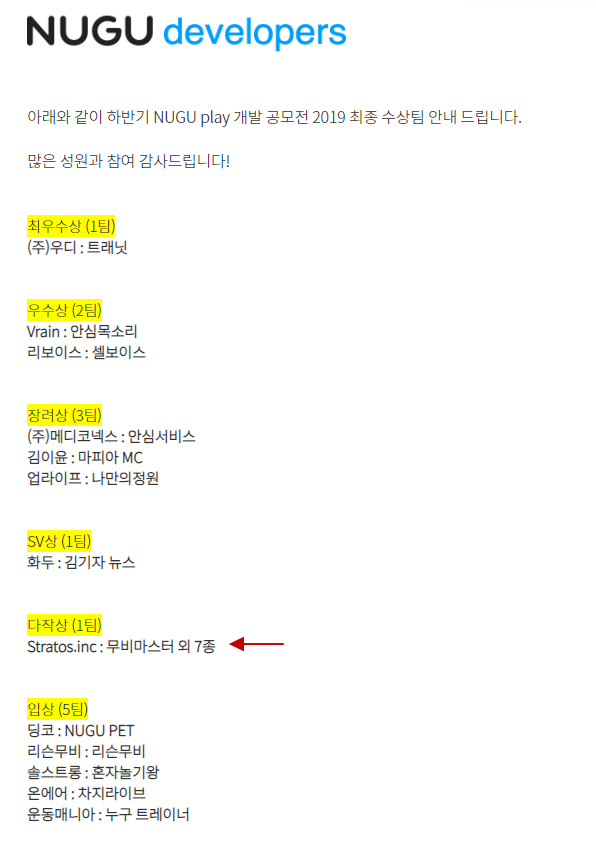

# SK NUGU playkit chatbot Backend & Intent file

이 페이지는 SK 누구 챗봇 모음입니다. 

* 코인마스터[nugu_coin_upbit] : 업비트 시세로 각종 가상화페 시세 읽기
* 투데이한강[nugu_hanriver] : 한강 온도
* 건강마스터[nugu_healthMaster] : 스마트워치&밴드의 만보기 등의 데이터와 날씨 비교. Oauth2 사용. [공식홈페이지 소계](http://blog.naver.com/nuguai/221472224053).
* 로또마스터[nugu_lotto] : 로또 당첨번호와 액수, 그리고 회차별 조회. [공식홈페이지 소계](http://blog.naver.com/nuguai/221466531053).
* 인천공항출국장 [nugu_air] : 인천공항 출국장 대기인원
* 무비마스터 [nugu_movie] : 주별 전주, 일별 한국영화와 외국영화 별 순위
* 투데이명언 [nugu_wise] : 투데이명언, 명언 봇. [공식홈페이지 소계](http://blog.naver.com/nuguai/221613927356).
* 세계의시간 [nugu_worldtime] : 세계 도시의 시각
* 세계의날씨 [nugu_worldweather] : 세계 도시의 날씨
* ETC [nugu_etc] : 루나마스터, 단위마스터, 오늘의 차나 같은 잡다한 거 모음
* 부장님개그 [nugu_gag] : 부장님개그,
* 템플렛 [nugu_template] : SK NUGU Play를 위한 템플렛

각 파일의 폴더 처음의 training_data... 로 시작되는 json 파일은 nugu에서의 intent 백업 export파일입니다.

## 챗봇을 만들고 싶다면?

로또마스터[nugu_lotto]의 경우 초보자들이 만들기 쉽게 md 파일로 설명을 했습니다.
설명을 보시면 이해가 되실 겁니다.

## SK NUGU 3회 개발 공모전 다작상

부장님개그, 오늘의 차, 인천공항 출국장, 세계의 시간, 무비마스터, 코인마스터, 루나마스터, 단위마스터
총 8개의 챗봇으로 2019년 SK NUGU 3회 개발 공모전에서 다작상을 받았습니다.

* [기획서](./pds/NUGU_Play_2019_0815RisingBloom_1.pptx)
* [발표용 기획서](./pds/NUGU_Play_2019_0827RisingBloom_2.pptx)

> 클라우드 서버는 Google Cloud platform의 cloud functions용으로 제작되었습니다.
> 건강마스터는 Google App engine + Google mysql입니다.
